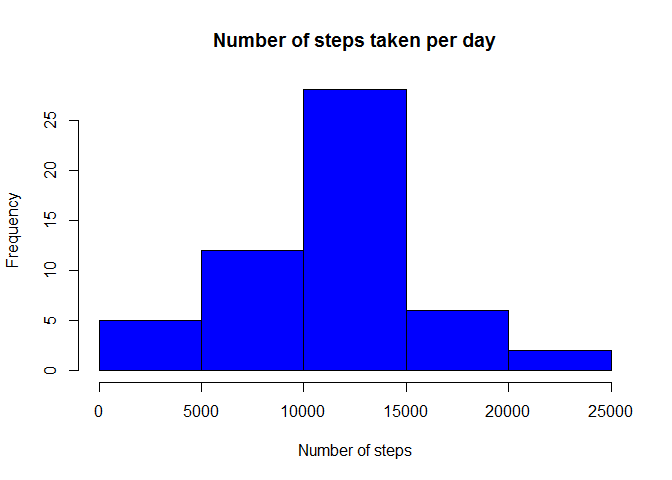
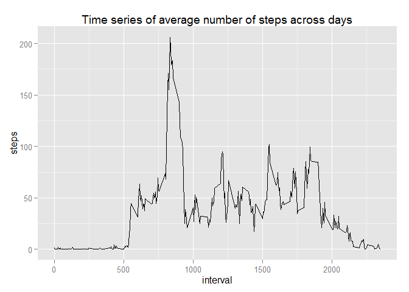
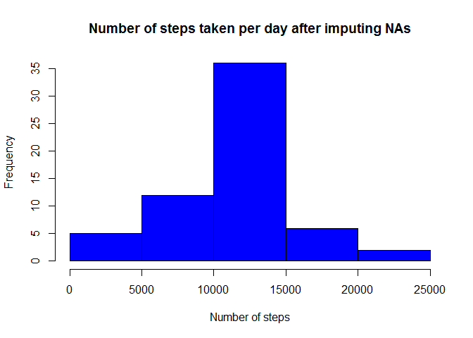
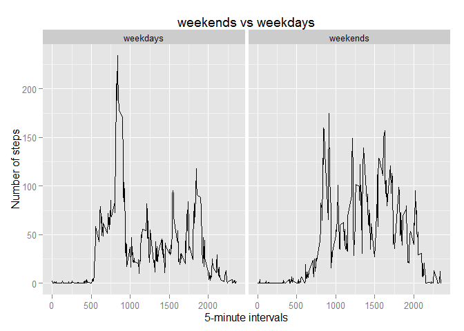

# PA1_template

## Reading data

Loading data using read.csv. Converting the date column into date form using the lubridate package.


```r
activity <- read.csv("activity.csv")
library(lubridate)
activity$date <- ymd(activity$date)
```
---------------------------------------------------------------------

##Part 1 : analysing the steps taken

Aggregrate function is used to group the steps taken by days.Sum of number of steps taken is calculated using the sum function. NA values are removed for this analysis.
A histogram of the steps taken is plotted using the base R hist() function. The x-label is renamed to read "Number of steps taken", and histogram is colored blue.
Mean and median are estimated and returned. The value of mean is rounded to two decimal places.

```r
sum_steps <- aggregate(steps~date, data=activity, FUN=function(activity) c(sum= sum(activity, na.rm=TRUE)))
hist(sum_steps$steps, xlab= "Number of steps", main= "Number of steps taken per day", col="blue")
```

 

```r
mean_steps <- round(mean(sum_steps$steps, na.rm=TRUE),2)
median_steps <- median(sum_steps$steps, na.rm=TRUE)
mean_median <- paste("The average number of steps taken per day is", mean_steps, "and the median is", median_steps, sep =" ")
print (mean_median)
```

```
## [1] "The average number of steps taken per day is 10766.19 and the median is 10765"
```
---------------------------------------------------------------------

##Part 2 : average daily activity pattern

Aggregate function was used to obtain mean steps across all days.
ggplot2 package was used to plot the time series of average number of steps taken, averaged across all days. 95% confidence interval is shown by the thicker shade around the line.
dplyr package of R was used to identify the interval in which maximum number of steps where taken(sum over all days). The returned result shows both the interval and the total number of steps taken.


```r
avg_steps <- aggregate(steps~interval, data=activity, FUN=function(activity) c(mean= mean(activity, na.rm=TRUE)))
library(ggplot2)
qplot(interval, steps, data	=	avg_steps, geom	= "line")+ labs(title = "Time series of average number of steps across days")
```

 

```r
library(dplyr)
```

```
## 
## Attaching package: 'dplyr'
## 
## The following objects are masked from 'package:lubridate':
## 
##     intersect, setdiff, union
## 
## The following object is masked from 'package:stats':
## 
##     filter
## 
## The following objects are masked from 'package:base':
## 
##     intersect, setdiff, setequal, union
```

```r
sactivity <- arrange(avg_steps, desc(steps))
sactivity[1,]
```

```
##   interval    steps
## 1      835 206.1698
```
----------------------------------------------------------------------

##Part 3 : imputing missing values

The data frames are convereted into data tables using the data.table package. The data table (activity, renamed as nactivity to preserve the original data file) has na values. In part 2, we created grouped data called sacivity (where steps are grouped by intervals using mean function). The strategy is to **fill na with mean steps taken during that interval across all days**. Using the logical function is.na, all na values are replaced by mean values read from sactivity file. A new file called "fill_activity" is created. 
The second half executes the same code as part 1 of the problem, but using the fill_activity file instead of the activity file.

```r
sum(is.na(activity$steps))
```

```
## [1] 2304
```

```r
library(data.table)
```

```
## 
## Attaching package: 'data.table'
## 
## The following objects are masked from 'package:dplyr':
## 
##     between, last
## 
## The following objects are masked from 'package:lubridate':
## 
##     hour, mday, month, quarter, wday, week, yday, year
```

```r
sactivity <- data.table(sactivity, key = "interval")
nactivity <- data.table(activity, key = "interval")
fill_activity <- nactivity[sactivity]
fill_activity[is.na(steps), steps:= i.steps]
```

```
## Warning in `[.data.table`(fill_activity, is.na(steps), `:=`(steps,
## i.steps)): Coerced 'double' RHS to 'integer' to match the column's type;
## may have truncated precision. Either change the target column to 'double'
## first (by creating a new 'double' vector length 17568 (nrows of entire
## table) and assign that; i.e. 'replace' column), or coerce RHS to 'integer'
## (e.g. 1L, NA_[real|integer]_, as.*, etc) to make your intent clear and for
## speed. Or, set the column type correctly up front when you create the
## table and stick to it, please.
```

```
##        steps       date interval  i.steps
##     1:     1 2012-10-01        0 1.716981
##     2:     0 2012-10-02        0 1.716981
##     3:     0 2012-10-03        0 1.716981
##     4:    47 2012-10-04        0 1.716981
##     5:     0 2012-10-05        0 1.716981
##    ---                                   
## 17564:     0 2012-11-26     2355 1.075472
## 17565:     0 2012-11-27     2355 1.075472
## 17566:     0 2012-11-28     2355 1.075472
## 17567:     0 2012-11-29     2355 1.075472
## 17568:     1 2012-11-30     2355 1.075472
```

```r
fill_sum_steps <- aggregate(steps~date, data=fill_activity, FUN=function(fill_activity) c(sum= sum(fill_activity)))
hist(fill_sum_steps$steps, xlab= "Number of steps", main= "Number of steps taken per day after imputing NAs", col="blue")
```

 

```r
fill_mean_steps <- round(mean(fill_sum_steps$steps, na.rm=TRUE),2)
fill_median_steps <- median(fill_sum_steps$steps, na.rm=TRUE)
fill_mean_median <- paste("The average number of steps taken per day is", fill_mean_steps, "and the median is", fill_median_steps, sep =" ")
print (fill_mean_median)
```

```
## [1] "The average number of steps taken per day is 10749.77 and the median is 10641"
```

```r
mean_diff = abs(mean_steps - fill_mean_steps)
```

Imputing missing values with mean at the same interval across all days

results in a decrease of the mean by 16.42 and the median changed from being 10765 to 10641.The differences in the mean and the median are small, and imputing na values, doesn't really affect the values very much.
---------------------------------------------------------------------

##Part 4 : weekdays vs weekends

Lubridate package function wday is used to add a variable called "day" to the activity table. The factors are then re-written as weekdays or weekends using the plyr package function revalue. The activity file is split into two files : one for weekdays and one for weekends. The same aggregate function used in parts 1 and 2 are used to arrive at average number of steps taken across all days. The two files, merged back into a single file called "days_steps". This file is called using the ggplot function to arrive at the desired plot, time series analysis of average number of steps taken, on weekends vs weekdays (in two panels).


```r
activity$day <- as.factor(wday(activity$date))
library(plyr)
```

```
## -------------------------------------------------------------------------
## You have loaded plyr after dplyr - this is likely to cause problems.
## If you need functions from both plyr and dplyr, please load plyr first, then dplyr:
## library(plyr); library(dplyr)
## -------------------------------------------------------------------------
## 
## Attaching package: 'plyr'
## 
## The following objects are masked from 'package:dplyr':
## 
##     arrange, count, desc, failwith, id, mutate, rename, summarise,
##     summarize
## 
## The following object is masked from 'package:lubridate':
## 
##     here
```

```r
activity$day <- revalue(activity$day, c("2" = "weekday","3" ="weekday", "4" ="weekday", "5"="weekday","6" ="weekday", "7" ="weekend", "1" = "weekend"))

weekdays <- filter(activity, day == "weekday")
weekends <- filter(activity, day == "weekend")

weekdays_steps <- aggregate(steps~interval, data= weekdays, FUN=function(weekdays) c(mean= mean(weekdays, na.rm=TRUE)))
weekdays_steps$day <- "weekdays"
weekends_steps <- aggregate(steps~interval, data= weekends, FUN=function (weekends) c(mean= mean(weekends, na.rm=TRUE)))
weekends_steps$day <- "weekends"
days_steps <- rbind(weekdays_steps, weekends_steps)

g <- ggplot(days_steps, aes(interval, steps))
g + geom_line()+ facet_wrap(~day)+ 
labs (x = "5-minute intervals") +labs(y= "Number of steps") + labs(title ="weekends vs weekdays")
```

 
----------------------------------------------------------------------

End of script.
